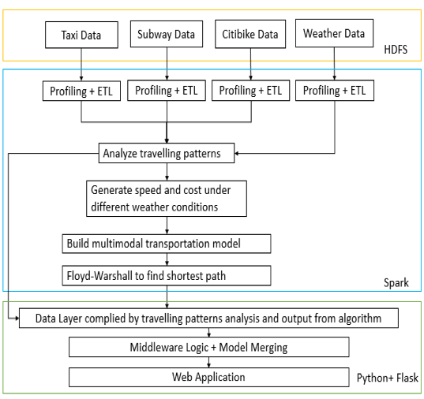

<h1 align=center> NYC-Traffic-Recommendation-System</h1>

<h2 align = "center">Overview</h2>

The aim of this project is to develop a NYC multimodal transportation recommendation system based on exploring the travelling pattern of citizens taking various public transportation tools in NYC. At the stage of exploring user group’s preference and travelling patterns, multiple datasets such as taxi data, bike data, subway data and weather data are collected. 
 
 During the analytics, Spark and Scala are used to fully understand these data and to find useful insights important for building the recommendation model. For the model, a multi-objective optimization model considering the time and weather is built. In this project, the multi-objective model is transferred into single objective optimization problem using weighted sum method. Floyd-Warshall algorithm is utilized to find the optimal path. Finally, based on the model we built a recommendation system. On the front-end web application built by Python Flask, users can choose the origin and destination location and the website would provide the “best route” (lowest cost route) consisted of different transportation modes to the user.  

The Project Design Diagram is shown below, 

<b>Please click on the dropdown to see the detailed Application Design</b></strong>

	At the first stage of the project, data including taxi, subway, citibike and weather from different sources is collected and stored in Hadoop HDFS. In Spark, the travelling patterns of taxi, subway and citibikes are analyzed under different weather conditions and time periods. Average velocity and cost of each transportation mode under different weather conditions and time period are generated. With the result of analysis, a multimodal transportation recommendation model minimizing both duration and cost is built and Floyd-Warshall algorithm is utilized to find the optimal path.

After preforming the previous steps, we would gather enough information from the algorithm and analytics to compile the data layers. Data layers has the highly aggregated metadata which are much smaller than original data and running result from the Floyd Washer Algorithm. We created this layer to accelerate the program speed by avoiding running the back-end spark data query code from the beginning and Floyd-Warshall algorithm implementation every time when a user query for the best route information, since the cost for running either spark data query code and Floyd Warshall Algorithm code is very high. Therefore, data layer can be considered as caching the output from data analysis and the algorithm in a sense. However, to keep the data layers up to date, we plan to automate the process of data layers updating itself from the newest data in Spark in the future.

With the data layer constructed as described above, we have the options to build numerous applications on top on it. Because of the limitation of time, we would build a web application as demonstration for the project.

<b>Please click on the dropdown to see the detailed data description</b></strong>

 <h2 align = "center">Detailed Data Description</h2>

As discussed above, we mainly made use of four different kinds of data: Taxi Data, Subway Data, Bike Data, and Weather Data. 

<h3 align = "center"> Taxi Data Description</h3>

Yellow Taxi and For-Hired Vehicle data (10GB) were extracted from New York City TLC trip record data. There are in total 19 fields in the raw data including break-down of the total trip fee, trip distance, start location, ending location, etc. The time range for taxi data that we will be using for this project is from 01/01/2018 to 12/31/2018. After processing the data, eights fields that are relevant to the research are retained. Information about these columns are listed below.

|Columns    |Type    |Max         |Min         |
|:---------:|:------:|:----------:|:----------:|
|start Date |	String | 2018-12-31 | 2018-01-01 |
|start Time	|String	 |4           |	1          |
|end Date	  |String	 |2018-12-31	|2018-01-01  |
|end Time	  |String  |  	4	      |1           |
|trip Dist	|Double	 |99.95	      |     0      |
|pickup	    |String	 |265	        |   0        |
|dropoff  	|String	 |265	        |0           |
|amount   	|Double	 |999.56	    |0           |

Pick up and drop off locations are the number mapped by the TLC taxi zone in New York City. The amount is the aggregated taxi fee for a trip. 

<h3 align = "center"> Subway Data Description</h3>
Subway data (100KB) was downloaded from NYC Open Data. This dataset includes the location of subway stations in NYC. The schema of the data is as follows.

|Columns    |Type    |	Max(value length)|Min(value length)|
|:---------:|:------:|:----------:|:----------:|
|Name |	String	| 34         |	 5         |
|Latitude	  |Double  |	 14	       |12          |
|Longitude	 |Double	 |11 	        |15          |
|Line       |	String	|15	         |1           |

<h3 align = "center"> Citibike Dataset Description</h3>
Citibike data (5GB) is accessed from Citibike official website. Citibike record data in the New York City is collected from 1/1/2018 to 31/12/2018. The schema of Citibike dataset is shown as follows.

|Columns|Type|Max(value/value length)|	Min(value/value length)
|:---------:|:------:|:----------:|:----------:|
|Duration|	Int|	19510049|	61|
|Start_time|	String|	19	|19|
|Stop_time	|String	|19	|19|
|Latitude|	Double|	45.506|	40.647|
|Longitude|	Double|	-73.569|	-74.025|

<h3 align = "center"> Weather Description</h3>
Weather data (4.8MB) was downloaded from National Centers For Environmental Information. We collected the New York City weather data from 1/1/2018 to 31/12/2018. The size of this dataset is 4.8 MB. It contains lots of useful columns, such as windspeed, temperature and precipitation. The schema of this dataset is as follows.

|Columns|Type|Max|Min|
|:---------:|:------:|:----------:|:----------:|
|Date|String|21|21|
|Temperature|Double|	95|	5|
|Precipitation	|Double	|1.69	|0.0|
|Windspeed	|Double	|21	|0|

For more detailed description of the project, please kindly read our paper [NYC_Traffic_Model.pdf](/NYC_Traffic_Model.pdf) which contains all of our findings, project demonstrations, result visualization and details explanation.

